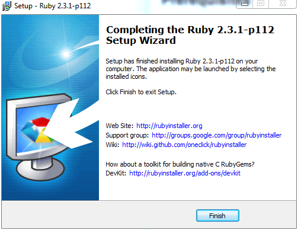

## Prerequisites
### Get Ruby Installed
* [Download the Ruby installer for your system](http://rubyinstaller.org/downloads/)
* Complete Installation with the installer
**Note: it's highly recommended to check the option of *[Adding Ruby executables to Path variables]* that can be found in the 2nd last step in order to avoid to manually specify Ruby's path on each use.**  

## Install Jekyll with RubyGems
[RubyGems](https://rubygems.org/) must have been installed with Ruby. Open a command prompt and type in the command below:

~~~
gem install jekyll
~~~

All of Jekyll's gem dependencies are automatically installed by the above command. So you won't have to worry about them at all.

For mainland Users who have troubles in accessing [the original source](https://rubygems.org/), you can switch to [Gem Source of Taobao](https://ruby.taobao.org/) by following commands:

~~~
gem sources --remove https://rubygems.org/    
gem sources --add https://ruby.taobao.org/  
~~~ 

